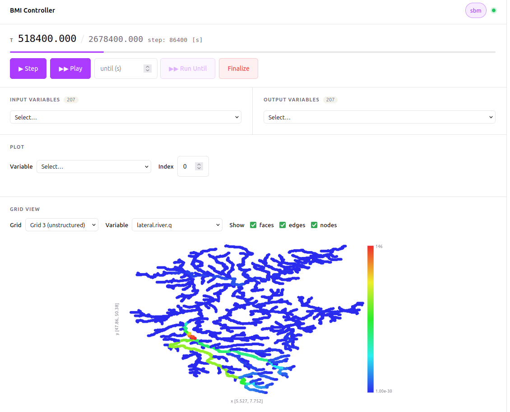

# 🎩 BMI Controller

A browser-based controller for [Remote BMI](https://github.com/eWaterCycle/remotebmi) models. Connects to a running Remote BMI server and lets you initialize, step, and inspect the model — including variable plots and grid visualization.

## Example

Using Wflow.jl's Moselle example dataset:




## Prerequisites

- [Node.js](https://nodejs.org/) 20+
- [pnpm](https://pnpm.io/) (`npm install -g pnpm`)
- A running Remote BMI server on `http://localhost:50051`

## Setup

```bash
pnpm install
```

## Development

```bash
pnpm dev
```

Opens at `http://localhost:5173`. The dev server will connect to `http://localhost:50051` upon initialization, so the Remote BMI server must be running before you interact with the UI.

## Build

```bash
pnpm build      # type-check + bundle to dist/
pnpm preview    # serve the production build locally
```

## Regenerate API types

The TypeScript types in `src/api/schema.d.ts` are generated from the Remote BMI OpenAPI spec:

```bash
pnpm generate:api
```

## Features

- Initialize, step, run-until, and finalize a BMI model
- Set and inspect input/output variables
- Time-series plot for any output variable
- Grid viewer with per-variable color mapping (uniform rectilinear, rectilinear, structured quadrilateral, unstructured)
- CF conventions time display (`seconds since …`, `hours since …`, etc.)

## AI Usage

This repository was largely written using Claude Code.
